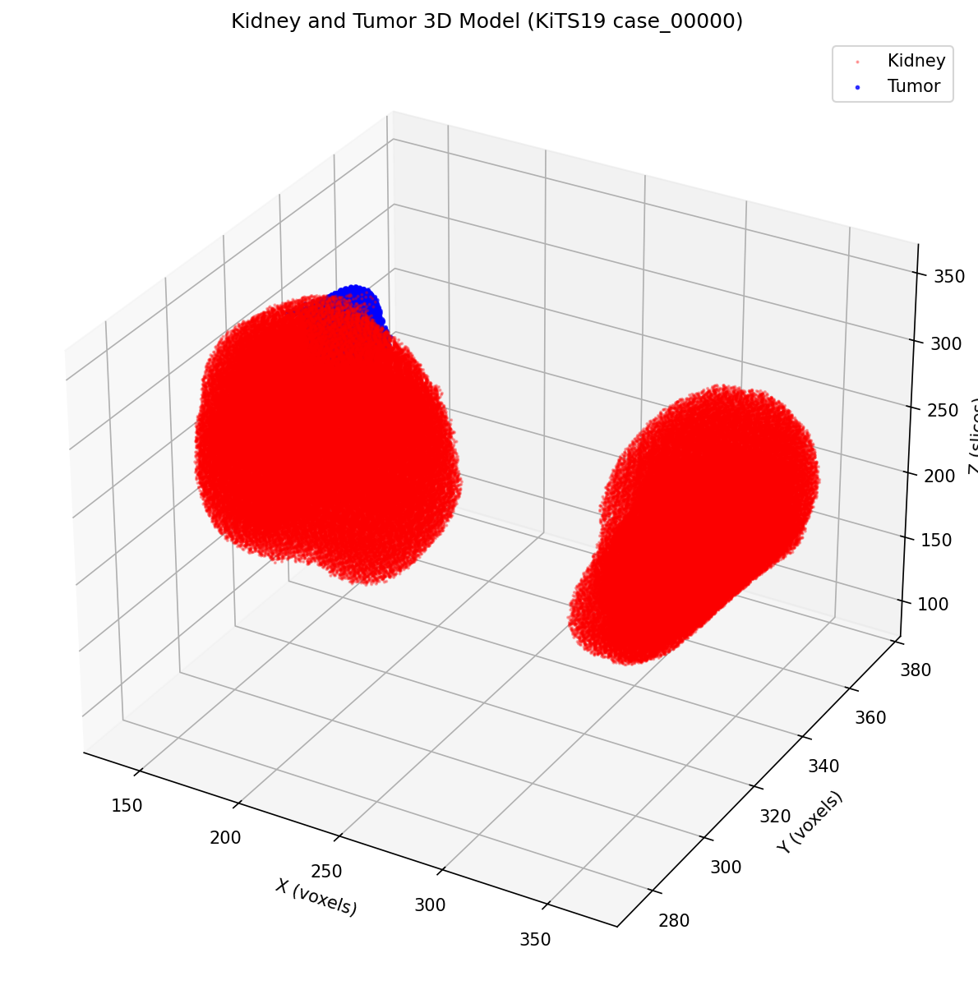
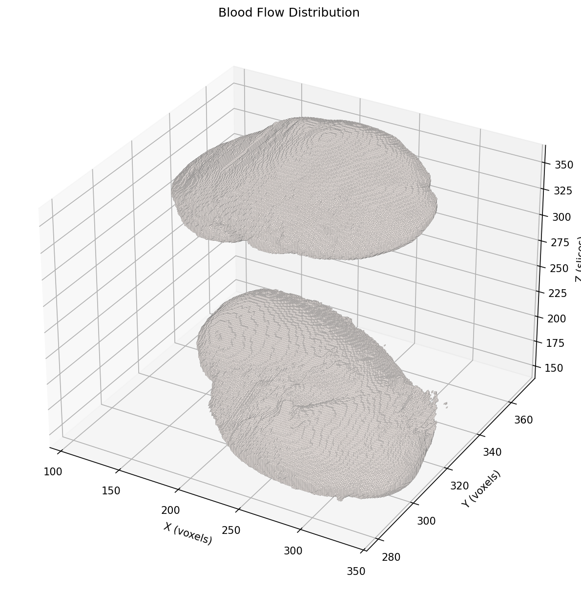

# 06_3d_visualization

## Реализовано

| Файл | Описание |
|:---|:---|
| `01_surface_extraction.py` | Извлечение 3D поверхности из маски сегментации |
| `02_plot_kidney_3d.py` | 3D визуализация почки и опухоли |
| `03_plot_flow_on_surface.py` | Наложение карты кровотока на 3D модель |
| `kidney_3d.png` | 3D модель почки |
| `kidney_tumor_3d.png` | Почка (красный) + опухоль (синий) |
| `flow_on_kidney.png` | Распределение кровотока на поверхности |
| `kidney_mesh.ply` | Mesh файл для ITK-SNAP/MeshLab |

## Планируемое содержание

- визуализация полей деформации
- наложение зарегистрированных объемов
- анимация процесса регистрации

## Визуализация

### 3D модель почки и опухоли



### Кровоток на поверхности почки



## Просмотр в ITK-SNAP

```bash
open -a ITK-SNAP ../data/kits19/data/case_00000/segmentation.nii.gz
