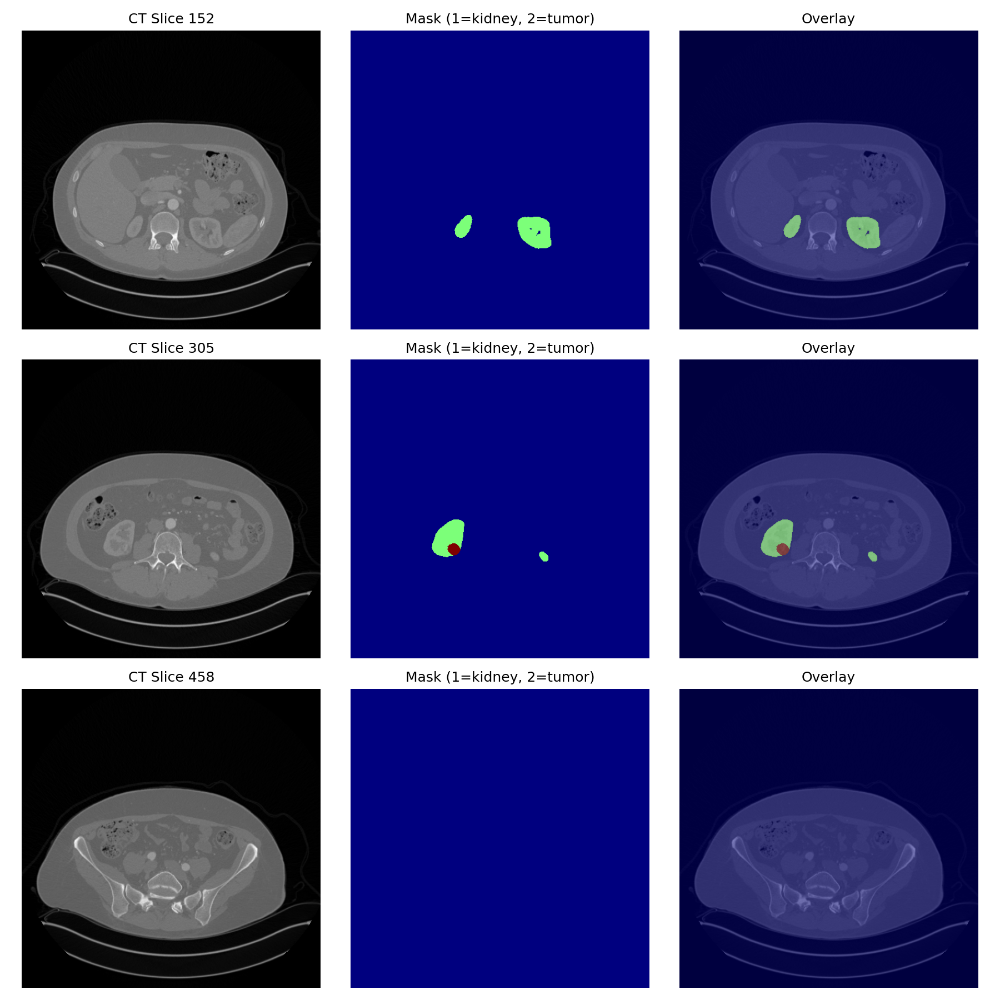

# med-analytics-portfolio

## Описание репозитория

Портфолио для стажировки **«Аналитик медицинских данных»** в проекте **SechenovAI_Nephro**.

Проект направлен на планирование хирургических операций на основе автоматического построения 3D моделей почек по данным МСКТ с контрастом. Основная задача стажировки — оптимизация алгоритмов регистрации изображений и повышение уровня готовности модели кровотока с УГТ-2 до УГТ-3.

## Визуализация реальных данных KiTS19

Ниже показаны три среза КТ почки с контрастом (из публичного датасета KiTS19):

- **Серое изображение** — оригинальное КТ
- **Цветное** — маска сегментации (1 = почка, 2 = опухоль)
- **Наложение** — маска поверх КТ



## Результаты работы

| Демонстрация | Результат |
|:---|:---|
| Регистрация (rigid) | MI = -0.0583, [сравнение](registration_comparison.png) |
| Модель кровотока (Kety) | [График вымывания контраста](kety_model_curves.png) |

## Структура репозитория

| Папка | Содержание |
|:---|:---|
| `01_python_numpy_essentials/` | Векторизация, broadcasting, бенчмарки (ускорение 1000x) |
| `02_medical_imaging_basics/` | Загрузка DICOM/NIfTI, конвертация в HU, визуализация |
| `03_validation_metrics_basics/` | Dice, Hausdorff, объёмные метрики на KiTS19 |
| `04_image_registration/` | Rigid, affine, B-spline, Demons регистрация + [демо](04_image_registration/rigid_registration_demo.py) |
| `05_blood_flow_model/` | Модель Кити, модель кровотока на основе якобиана |
| `06_3d_visualization/` | 3D-модели почек, визуализация кровотока |
| `data/` | Инструкции по получению данных |

## Демонстрация регистрации

Запуск rigid регистрации с визуализацией до/после:

```bash
python3 04_image_registration/rigid_registration_demo.py
